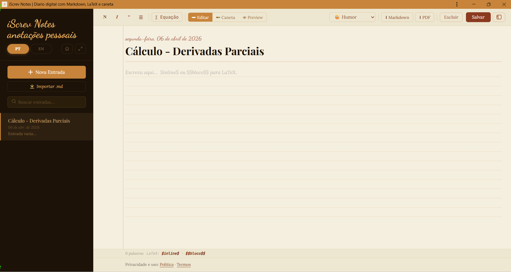

# iScrev

[Read this in English](EN.md)

---

## iScrev Notes

> Um diário digital com alma de caderno.

O iScrev Notes é uma aplicação web de anotações e diário pessoal que combina a simplicidade da escrita digital com o calor e a liberdade de um caderno físico. Projetado com uma filosofia **local-first**, ele garante que todos os seus dados permaneçam exclusivamente no seu dispositivo, sem a necessidade de contas, login ou conexão com a nuvem.

A experiência é focada em baixa distração e alta imersão, utilizando uma identidade visual inspirada em papel, tinta e tipografia editorial para criar um ambiente de escrita confortável e acolhedor.

---

## ✨ Funcionalidades

O aplicativo principal, `diario.html`, oferece um conjunto integrado de ferramentas para pensamento e registro:

-   📝 **Editor Híbrido:** Escreva com texto puro, formate com **Markdown** e adicione equações matemáticas complexas com **LaTeX** (`$...$` para inline e `$$...$$` para bloco).
-   ✒️ **Caneta Manuscrita:** Mude para o modo "Caneta" para desenhar, rabiscar ou fazer anotações manuscritas diretamente sobre a área de texto, usando uma caneta SVG com suavização de traços.
-   🔐 **Privacidade Total (Local-First):** Seus dados são salvos no seu navegador usando IndexedDB, garantindo total privacidade e funcionamento offline.
-   💾 **Importe e Exporte:** Faça backup de suas entradas como arquivos `.md`, que incluem as anotações manuscritas embutidas. Exporte também para `.pdf` para compartilhamento e impressão. 
-   🌐 **Multi-idioma:** A interface está disponível em Português e Inglês, com detecção automática baseada no idioma do seu navegador.
-   🚫 **Zero Complicação:** Sem frameworks, sem etapa de build, sem dependências externas (exceto fontes e KaTeX via CDN). Apenas abra no navegador e comece a usar.
-   📱 **Design Responsivo:** A interface se adapta para uso em desktops, tablets e smartphones.

## 🚀 Como Usar o iScrev Notes

A forma mais simples e recomendada de usar o iScrev Notes é diretamente no seu navegador, sem a necessidade de download ou configuração de servidores.

1.  **Acesse a aplicação online:**
    Visite o site oficial do projeto e clique no link para abrir o diário. A aplicação foi projetada para funcionar imediatamente.

2.  **Comece a escrever:**
    - Use o botão **"Nova Entrada"** na barra lateral para criar sua primeira nota.
    - Escreva no editor principal. Use os botões da barra de ferramentas para formatar o texto com Markdown ou inserir equações com LaTeX.
    - Alterne entre os modos **"Editar"**, **"Caneta"** e **"Preview"** para acessar as diferentes funcionalidades.
    - Suas anotações são salvas automaticamente no seu navegador.

> **Nota para Desenvolvedores:** Se você clonou o repositório para rodar o projeto localmente, lembre-se que os arquivos (`diario.html`, `diario.css`, `diario.js`) precisam ser servidos via HTTP devido às políticas de segurança dos navegadores (CORS). Utilize um servidor local simples como `python -m http.server` ou a extensão "Live Server" do VS Code.

## 🛠️ Stack Tecnológica

-   **HTML5**
-   **CSS3** (com Variáveis CSS para theming)
-   **JavaScript (ES5)** (puro, sem frameworks, encapsulado em IIFE)
-   **KaTeX** (para renderização de LaTeX)
-   **SVG** (para o módulo de caneta manuscrita)
-   **IndexedDB** (para persistência de dados local)
