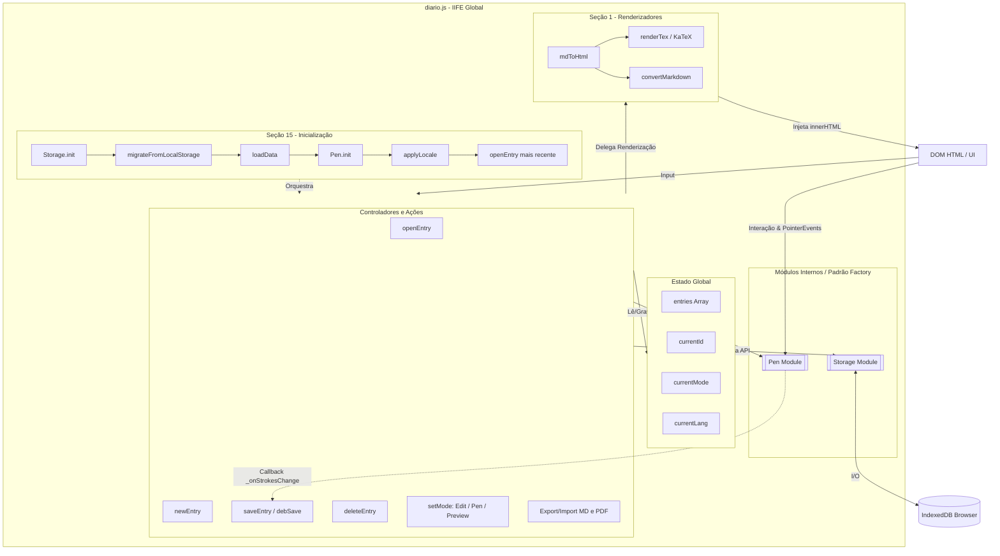

# Arquitetura do iScrev Notes e Análise do `diario.js`

## 1. Introdução ao Projeto iScrev Notes

O **iScrev Notes** é uma aplicação web de anotações e diário pessoal focada nos conceitos de **computação acolhedora** e **local-first**. Seu objetivo é unir a simplicidade e o foco da escrita digital com a liberdade expressiva de um caderno físico. 

A aplicação permite aos usuários expressarem-se através de três formas perfeitamente integradas em uma única tela:
1. **Texto Estruturado** usando sintaxe Markdown.
2. **Fórmulas e Equações** usando LaTeX (via KaTeX).
3. **Anotações Manuscritas/Desenhos** através de uma caneta SVG fluida.

A privacidade e autonomia são premissas fundamentais do iScrev Notes. Não há sincronização obrigatória com a nuvem, necessidade de criação de contas ou rastreamento de dados: todas as informações são mantidas e geridas no próprio navegador do usuário (armazenamento persistente local). Além disso, o projeto assume uma postura técnica de **Zero Build Step** (sem etapa de compilação), utilizando HTML5, CSS3 e JavaScript ES5 puro.

---

## 2. A Arquitetura Geral

Arquiteturalmente, o iScrev é uma **Single-Page Application (SPA)** de interface responsiva e imersiva. 

* **Interface e Estilização:** Baseada em um único arquivo HTML principal (`diario.html`) e estilizada em `diario.css`, que utiliza Variáveis CSS e Flexbox para resolver problemas complexos de interface (como o "bug do paralaxe" entre linhas de caderno e o texto).
* **Persistência de Dados:** Abstraída no cliente através da API **IndexedDB**, garantindo alta capacidade de armazenamento para notas longas e desenhos SVG (que contêm múltiplos pontos de dados), possuindo um *fallback* transparente para o tradicional `localStorage` em cenários de falha.
* **Módulos Periféricos:** Lógicas apartadas que resolvem contextos específicos sem poluir o núcleo de renderização, como o PDF Exporter (`pdf-exporter.js`) para manipulação de paginação visual, e os roteamentos institucionais (`site-nav.js`, `support.js`).

---

## 3. A Arquitetura em `diario.js` (O "Monolito Funcional")

O núcleo de processamento, regras de negócio e controle de estado do iScrev Notes habita o arquivo `diario.js`. Ele é desenhado como um **"Monolito Funcional"** encapsulado inteiramente dentro de uma **IIFE (Immediately Invoked Function Expression)** para garantir que as variáveis e lógicas não poluam o escopo global (evitando atritos com bibliotecas CDN, como o `katex`).

O arquivo cresceu de forma orgânica, mas extremamente organizada, e hoje está segmentado em 15 seções conceituais fundamentais:

### 3.1. Estado Compartilhado e CRUD
O estado da aplicação (`entries`, `currentId`, `currentMode`) vive na raiz da IIFE e é compartilhado entre todas as funções internas. As lógicas de CRUD (Criação, Leitura, Atualização, Exclusão de entradas) atualizam esse estado e se comunicam diretamente com a camada de `Storage`.

### 3.2. Renderização (Markdown + LaTeX)
O script conta com um *parser* leve customizado, focado em uma estratégia de tokenização de dois passos:
1. Extrai seções de LaTeX embutidas (blocos `$$...$$` e inlines `$..$`), reservando-as.
2. Executa Regex para substituir o Markdown nativo.
3. Converte os tokens de matemática usando `katex.renderToString()`, devolvendo uma saída HTML segura (escapada via `escHtml`).

### 3.3. O Módulo `Pen` (Caneta SVG)
Uma IIFE interna injetada no monolito atua no padrão *Revealing Module*. É o código mais complexo em `diario.js`. Ele reage a Pointer Events e usa **curvas de Bézier quadráticas** para suavizar as linhas em tempo real e, para otimizar espaço de armazenamento ao salvar o desenho, aplica o algoritmo geográfico **Douglas-Peucker**, simplificando o número de pontos sem perda visual.

### 3.4. O Módulo `Storage` (IndexedDB Wrapper)
Outra IIFE interna que cuida unicamente da persistência das notas via banco de dados local. Trabalha com `Promises` e gerencia a lógica silenciosa de abrir a conexão local, resgatar todas as *entries* via `getAll()`, gravar atualizações pelo `put()` e expurgar com o `remove()`.

### 3.5. Auto-Save e Importação/Exportação
O `diario.js` provê funções com *debounce* temporal para o *Auto-Save* (que monitora digitações), poupando tráfego desnecessário de I/O em banco. Na importação/exportação, os traços SVG nativos são envelopados num formato Base64 limpo e combinados via um parser Markdown Frontmatter YAML.

---

## 4. Diagrama da Arquitetura do `diario.js`

O diagrama a seguir (desenhado com Mermaid) ilustra a organização atual de funções e módulos e como o estado da aplicação flui no arquivo monolítico principal.

---

## 5. Visão de Evolução (Rumo aos Módulos ES6)

Como pode ser observado, o `diario.js` comporta atualmente o papel de **Camada de Infraestrutura**, **Camada de UI** e **Camada de Regras de Negócios**. Essa centralização foi uma escolha pragmática, eficiente para validar e construir o produto com rapidez, mas que atinge agora seu "limite de complexidade sustentável".

A evolução arquitetural natural em curso propõe a quebra controlada desse arquivo seguindo o padrão nativo **ESM (ECMAScript Modules)**. No futuro, módulos independentes baseados em intenção – como `storage.js`, `pen.js`, `markdown.js` e um controlador `editor.js` – substituirão o "Monolito Funcional", promovendo testabilidade (testes unitários isolados), reuso de lógica e injeção de dependência mais sofisticada.