# iScrev Notes — Arquitetura e Documentação Técnica do `diario.js`

> **Produto:** iScrev Notes  
> **Arquivo documentado:** `assets/js/diario.js`  
> **Linhas:** ~2.996 · **Tamanho:** ~111 KB  
> **Versão da documentação:** maio de 2026  
> **Stack:** HTML5 · CSS3 · JavaScript ES5 · KaTeX 0.16.11 · IndexedDB  

---

## Sumário

1. [Visão Geral do Projeto](#1-visão-geral-do-projeto)
2. [Estrutura de Arquivos do Projeto](#2-estrutura-de-arquivos-do-projeto)
3. [Arquitetura Geral do `diario.js`](#3-arquitetura-geral-do-diariojs)
4. [Diagrama de Módulos e Fluxo de Dados](#4-diagrama-de-módulos-e-fluxo-de-dados)
5. [Seção 0 — Internacionalização (i18n)](#5-seção-0--internacionalização-i18n)
6. [Seção 1 — Renderização LaTeX e Markdown](#6-seção-1--renderização-latex-e-markdown)
7. [Seção 2 — Módulo Pen (SVG + Pointer Events)](#7-seção-2--módulo-pen-svg--pointer-events)
8. [Seção 2.5 — Módulo Storage (Persistência Dual)](#8-seção-25--módulo-storage-persistência-dual)
9. [Seção 3 — Estado e Persistência](#9-seção-3--estado-e-persistência)
10. [Seções 4 a 6 — Utilitários, Toast e Sidebar](#10-seções-4-a-6--utilitários-toast-e-sidebar)
11. [Seção 7 — Controle de Modo](#11-seção-7--controle-de-modo)
12. [Seção 8 — CRUD de Entradas](#12-seção-8--crud-de-entradas)
13. [Seções 9 e 10 — Formatação e Diálogo de Equação](#13-seções-9-e-10--formatação-e-diálogo-de-equação)
14. [Seção 11 — Exportação e Importação](#14-seção-11--exportação-e-importação)
15. [Seções 12 e 13 — Auto-save, Auto-resize e Fullscreen](#15-seções-12-e-13--auto-save-auto-resize-e-fullscreen)
16. [Seção 14 — Atalhos de Teclado e Fiação de Eventos](#16-seção-14--atalhos-de-teclado-e-fiação-de-eventos)
17. [Seção 15 — Inicialização](#17-seção-15--inicialização)
18. [Modelo de Dados](#18-modelo-de-dados)
19. [Fases do Desenvolvimento](#19-fases-do-desenvolvimento)
20. [Bugs Documentados e Soluções](#20-bugs-documentados-e-soluções)

---

## 1. Visão Geral do Projeto

O iScrev Notes é uma **Single-Page Application (SPA)** de diário digital pessoal que opera inteiramente no lado do cliente, sem servidor, sem processo de build e sem dependências JavaScript externas além do KaTeX para renderização matemática. O produto oferece uma experiência de caderno digital com visual acolhedor inspirado em papel e tinta.

### Filosofia técnica central

A premissa deliberadamente restritiva que guiou todas as decisões de design: **nenhum framework, nenhuma ferramenta de build, nenhum servidor**. Cada decisão foi avaliada contra o critério: *isso adiciona complexidade real ou apenas complexidade de ferramenta?*

### Funcionalidades principais

| Módulo | Capacidade |
|--------|-----------|
| Editor de texto | Textarea com Markdown básico e LaTeX |
| Renderização LaTeX | Equações inline `$...$` e bloco `$$...$$` via KaTeX 0.16.11 |
| Caneta manuscrita | Anotações SVG com Bézier quadrática e borracha geométrica |
| Três modos de uso | Editar · Caneta · Preview |
| CRUD completo | Criar · Abrir · Salvar (auto + manual) · Excluir entradas |
| Busca em tempo real | Filtro por título e corpo |
| Mood tracker | Emoji associado a cada entrada |
| Exportação Markdown | `.md` com YAML front matter e traços em base64 |
| Exportação PDF | `window.print()` com lógica de ciclo de vida assíncrona |
| Importação Markdown | Lê `.md` exportado e restaura texto e traços |
| Tela cheia | Fullscreen API nativa com atalho `F` |
| Internacionalização | PT-BR e EN com detecção automática |
| Persistência dual | IndexedDB com fallback transparente para localStorage |
| Modal de apoio | Integração com página de doação (Stripe + PIX) |

---

## 2. Estrutura de Arquivos do Projeto

```
projeto/
├── index.html              ← Home institucional em português
├── sobre.html              ← Página "sobre" em português
├── en.html                 ← Home institucional em inglês
├── about.html              ← Página "about" em inglês
├── diario.html             ← Interface principal do app de diário
└── assets/
    ├── css/
    │   ├── style.css       ← Estilos das páginas institucionais
    │   └── diario.css      ← Estilos do app de diário (~600 linhas)
    └── js/
        ├── diario.js       ← Lógica principal (~2.996 linhas)  ← ESTE ARQUIVO
        ├── pdf-exporter.js ← Módulo de exportação PDF paginado
        ├── ui.js           ← Placeholder de helpers de UI
        └── site-nav.js     ← Navegação das páginas institucionais
```

O `diario.js` é carregado no final do `<body>` do `diario.html`, após o DOM ser completamente parseado. Isso elimina a necessidade de `DOMContentLoaded` e garante que todos os `getElementById` encontram os elementos que procuram.

---

## 3. Arquitetura Geral do `diario.js`

O arquivo inteiro está encapsulado em uma **IIFE** (*Immediately Invoked Function Expression*) com `'use strict'`:

```javascript
(function () {
  'use strict';
  // ... todo o código da aplicação
})();
```

**Por que uma IIFE?** Cria escopo privado isolando todas as variáveis de `window`. Nenhuma variável polui o escopo global, evitando conflito com scripts externos como o KaTeX, que escreve `window.katex`. Em arquivos `.js` separados, módulos ES6 seriam a alternativa moderna, mas a IIFE mantém compatibilidade com browsers que não suportam `type="module"`.

### Mapa geral das seções

| Nº | Seção | Linhas aprox. | Responsabilidade |
|----|-------|---------------|-----------------|
| 0 | i18n | 9–459 | Dicionário bilíngue e atualização do DOM |
| 1 | LaTeX + Markdown | 460–568 | Tokenização e renderização HTML |
| 2 | Módulo Pen | 569–1360 | SVG, Pointer Events, borracha, Douglas-Peucker |
| 2.5 | Módulo Storage | 1361–1546 | IndexedDB com fallback localStorage |
| 3 | Estado e persistência | 1547–1596 | Fonte da verdade em memória, wrappers de I/O |
| 4 | Utilitários | 1597–1698 | uid, formatação de datas, responsividade |
| 5 | Toast | 1699–1713 | Notificações temporárias |
| 6 | Sidebar | 1714–1754 | Renderização e busca da lista de entradas |
| 7 | Controle de Modo | 1755–1969 | Alternância edit/pen/preview, notebook tail |
| 8 | CRUD | 1970–2066 | openEntry, newEntry, saveEntry, deleteEntry |
| 9 | Formatação toolbar | 2067–2097 | Inserção de Markdown via toolbar |
| 10 | Diálogo de equação | 2098–2196 | Modal LaTeX com preview em tempo real |
| 11 | Exportação / Importação | 2197–2592 | Markdown, PDF (dois fluxos), importação .md |
| 12 | Auto-save | 2593–2667 | Debounce de salvamento, callbacks do Pen |
| 13 | Fullscreen API | 2668–2760 | Tela cheia cross-browser |
| 14a | Atalhos de teclado | 2761–2796 | Ctrl+S, Ctrl+Z, F, Escape |
| 14b | Fiação de eventos | 2797–2921 | Todos os addEventListener do app |
| 15 | Inicialização | 2922–2995 | Sequência assíncrona de boot |

---

## 4. Diagrama de Módulos e Fluxo de Dados

O diagrama a seguir representa a arquitetura interna do `diario.js`, mostrando os dois submódulos com padrão IIFE revelador (`Pen` e `Storage`), o estado global da aplicação, os fluxos de dados entre os componentes e as dependências externas.

```mermaid
flowchart TD
    subgraph IIFE ["IIFE — diario.js (escopo privado)"]

        subgraph I18N ["Seção 0 — i18n"]
            I18N_DICT["I18N{}  dicionário estático\npt / en"]
            T["t(key)  triple fallback"]
            APPLY["applyLocale(lang)\n→ doApply(lang)\n→ TEXT_MAP DOM update\n→ mood-select rebuild\n→ Pen.buildToolbar()"]
            I18N_DICT --> T
            I18N_DICT --> APPLY
        end

        subgraph RENDER ["Seção 1 — Renderização"]
            MDHTML["mdToHtml(src)\ntokenizer LaTeX/Markdown"]
            RENDERTEX["renderTex(latex, display)\nkatex.renderToString()"]
            CONVMD["convertMarkdown(raw)\nMarkdown básico → HTML"]
            MDHTML --> RENDERTEX
            MDHTML --> CONVMD
        end

        subgraph PEN_MOD ["Seção 2 — Módulo Pen (IIFE revelador)"]
            PEN_STATE["Estado privado\nstrokes[] · drawing\nrawPts[] · penColor\npenWidth · eraserMode\npanMode · rafId"]
            PEN_ALGO["Algoritmos\nDouglas-Peucker rdp()\nBézier toPathD()\nHit-test eraserHitTest()"]
            PEN_EVT["Pointer Events\nonPointerDown/Move/Up/Cancel\nonWheel · onEraserClick"]
            PEN_SYNC["syncScroll()\ntranslate(0, -scrollTop)"]
            PEN_API["API pública\ninit · activate · deactivate\nload · getStrokes\nundo · clear · setColor\nsetWidth · setEraser · setPan\nbuildPrintSvg · buildPrintOverlay\nbuildToolbar"]
            PEN_NOTIFY["_onStrokesChange(strokes)\ncallback injetado pelo app"]
            PEN_STATE --> PEN_ALGO
            PEN_EVT --> PEN_STATE
            PEN_SYNC --> PEN_STATE
            PEN_API --> PEN_STATE
            PEN_API --> PEN_NOTIFY
        end

        subgraph STORAGE_MOD ["Seção 2.5 — Módulo Storage (IIFE revelador)"]
            IDB["IndexedDB\nmeu_diario_db v1\nobject store: entries"]
            LS_FB["localStorage fallback\nmeu_diario_v2"]
            ST_API["API pública Promise-based\ninit() · getAll()\nput(entry) · remove(id)\nbackend()"]
            ST_EVENTS["CustomEvents\nstorage:quota-exceeded\nstorage:error"]
            IDB --> ST_API
            LS_FB --> ST_API
            ST_API --> ST_EVENTS
        end

        subgraph STATE ["Seção 3 — Estado Global"]
            ENTRIES["entries[]  fonte da verdade\narray de Entry em memória"]
            CURRID["currentId  ID da entrada aberta"]
            LOAD["loadData()  Storage.getAll()"]
            SAVE_STORE["saveEntry_store(entry)\nStorage.put()"]
            RM_STORE["removeEntry_store(id)\nStorage.remove()"]
            LOAD --> ENTRIES
            SAVE_STORE --> IDB
            RM_STORE --> IDB
        end

        subgraph MODE ["Seção 7 — Controle de Modo"]
            CURRENT_MODE["currentMode\n'edit' | 'pen' | 'preview'"]
            SET_MODE["setMode(m)\nalterna display de raw/preview\nativa/desativa Pen\ncontrola pen-toolbar"]
            CANONICAL["renderCanonicalSurface()\nmdToHtml → preview.innerHTML"]
            NOTEBOOK_TAIL["notebook tail\nalinha linhas do caderno\nno modo caneta/preview"]
            PRINT_STAGE["buildPrintStage(entry)\nclona superfície para @media print"]
            SET_MODE --> CURRENT_MODE
            SET_MODE --> CANONICAL
            SET_MODE --> NOTEBOOK_TAIL
        end

        subgraph CRUD ["Seção 8 — CRUD"]
            OPEN["openEntry(id)"]
            NEW["newEntry()"]
            SAVE["saveEntry()"]
            DEL["deleteEntry()"]
            STATS["updateStats()\ncontagem de palavras"]
            OPEN --> ENTRIES
            OPEN --> PEN_API
            OPEN --> SET_MODE
            NEW --> ENTRIES
            NEW --> SAVE_STORE
            SAVE --> ENTRIES
            SAVE --> SAVE_STORE
            DEL --> ENTRIES
            DEL --> RM_STORE
        end

        subgraph EXPORT ["Seção 11 — Exportação / Importação"]
            EXP_MD["exportMarkdown()\nBlob + URL.createObjectURL"]
            EXP_PDF["exportPDF()\npdfExportBusy guard\nrunStagePrintJob()\n→ waitForPrintLifecycle()"]
            EXP_PDF_PAG["PdfExporter.exportEntry()\npdf-exporter.js externo\nfluxo sem traços"]
            IMP_MD["importMarkdown()\nFileReader + front matter YAML\natob pen_strokes"]
            EXP_MD --> PEN_API
            EXP_PDF --> PRINT_STAGE
            EXP_PDF --> EXP_PDF_PAG
            IMP_MD --> ENTRIES
            IMP_MD --> SAVE_STORE
        end

        subgraph AUTOSAVE ["Seção 12 — Auto-save"]
            DEB["debSave()\ndebounce 1800ms"]
            PEN_CB["Pen._onStrokesChange\nsalva imediatamente\nsem debounce"]
            DEB --> SAVE
            PEN_CB --> SAVE_STORE
        end

        subgraph FS ["Seção 13 — Fullscreen"]
            TOGGLE_FS["toggleFullscreen()\nprefixos cross-browser"]
            FS_ICON_UPD["updateFsIcon()\natualiza SVG + aria-label"]
            TOGGLE_FS --> FS_ICON_UPD
        end

        subgraph INIT ["Seção 15 — Inicialização"]
            INIT_SEQ["Storage.init()\n→ migrateFromLocalStorage()\n→ loadData() × 2\n→ Pen.init()\n→ applyLocale()\n→ openEntry(latest)"]
        end

    end

    subgraph EXTERNAL ["Externo ao diario.js"]
        KATEX["KaTeX 0.16.11\nwindow.katex\ncarregamento SÍNCRONO"]
        PDF_EXP["window.PdfExporter\npdf-exporter.js"]
        DOM["DOM — diario.html\n#pen-svg · #pen-layer\n#editor-area · #entry-raw\n#entry-preview · ..."]
        BROWSER_IDB["Browser IndexedDB API"]
        BROWSER_LS["Browser localStorage"]
    end

    RENDERTEX --> KATEX
    PEN_API --> DOM
    ST_API --> BROWSER_IDB
    ST_API --> BROWSER_LS
    EXP_PDF_PAG --> PDF_EXP
    APPLY --> DOM
    OPEN --> DOM
    INIT_SEQ --> INIT_SEQ

    INIT_SEQ --> ST_API
    INIT_SEQ --> PEN_API
    INIT_SEQ --> APPLY
    INIT_SEQ --> OPEN

    PEN_NOTIFY --> PEN_CB
```



---

## 5. Seção 0 — Internacionalização (i18n)

**Linhas:** 9–459 | **Funções:** `t()`, `applyLocale()`, `doApply()`

### Arquitetura

O sistema de internacionalização usa um **dicionário estático** com dois blocos de chave-valor. A abordagem é propositalmente simples: nenhuma biblioteca externa, nenhuma requisição de rede para traduzir strings.

```javascript
var I18N = {
  pt: { 'btn.new': 'Nova Entrada', 'mode.edit': 'Editar', ... },
  en: { 'btn.new': 'New Entry',    'mode.edit': 'Edit',   ... }
};
```

**Detecção automática de idioma na primeira visita:**

```javascript
var currentLang = (function () {
  var s = localStorage.getItem('diario_lang');
  if (s && I18N[s]) return s;
  // Usa o idioma do browser como fallback
  return (navigator.language || '').startsWith('pt') ? 'pt' : 'en';
}());
```

### Função `t(key)` — triplo fallback

```javascript
function t(key) {
  return (I18N[currentLang] && I18N[currentLang][key])  // 1. idioma ativo
      || (I18N.pt && I18N.pt[key])                       // 2. fallback português
      || key;                                             // 3. chave crua (nunca undefined)
}
```

### `doApply(lang)` — atualização do DOM

A função percorre um mapa explícito `TEXT_MAP` com 40+ entradas no formato `[id, chave, tipo]`. Cada tipo define como a string é aplicada:

| Tipo | Atributo atualizado | Exemplo de uso |
|------|---------------------|----------------|
| `'text'` | `el.textContent` | Labels de botões |
| `'html'` | `el.innerHTML` | Hint LaTeX com `<b>` |
| `'ph'` | `el.placeholder` | Textarea e inputs |
| `'title'` | `el.title` | Tooltips de botões |

**Por que `TEXT_MAP` explícito e não `data-i18n`?** A abordagem de atributo `data-i18n` exigiria varredura completa do DOM a cada troca. O mapa explícito toca apenas os ~40 elementos que realmente têm texto traduzível — mais eficiente e mais fácil de auditar. Evita também qualquer lógica de `querySelectorAll` global que poderia selecionar acidentalmente elementos indesejados.

**Sequência de `doApply`:**

1. Atualiza `currentLang` e persiste em `localStorage['diario_lang']`
2. Define `document.documentElement.lang` para acessibilidade e SEO
3. Percorre `TEXT_MAP` e atualiza os elementos
4. Reconstrói as `<option>` do `#mood-select` preservando a seleção atual
5. Atualiza o estado `.active` dos botões de idioma
6. Atualiza o botão `btn-home` com label e aria-label
7. Chama `Pen.buildToolbar()` para traduzir labels de cores e espessuras
8. Chama `updateStats()` para traduzir "palavra/palavras"
9. Chama `renderList()` para traduzir "Nenhuma entrada ainda"

### Novas chaves na versão atual

A versão atual do `I18N` inclui grupos de chaves não presentes em versões anteriores:

- **`legal.*`** — textos da barra de rodapé legal (`legal.prefix`, `legal.support`, `legal.privacy`, `legal.terms`)
- **`sup.*`** — modal de apoio/doação (título, descrição, parágrafos explicativos)
- **`pix.*`** — botão PIX de cópia de chave (`pix.label`, `pix.copy`, `pix.copied`, etc.)
- **`sidebar.show/hide`** — acessibilidade do toggle de sidebar
- **`toast.pdf/pdfErr/pdfUnavailable`** — três estados possíveis de exportação PDF

---

## 6. Seção 1 — Renderização LaTeX e Markdown

**Linhas:** 460–568 | **Funções:** `mdToHtml()`, `renderTex()`, `convertMarkdown()`, `escHtml()`

### Pipeline de dois passos

```
src (string bruta Markdown + LaTeX)
  │
  ↓  tokenização: /\$\$([\s\S]+?)\$\$|\$([^\$\n]+?)\$/g
  │
  → tokens: [ {k:'text', v:...}, {k:'inline', v:...}, {k:'block', v:...}, ... ]
  │
  ↓  tokens.map()
     ├── k='block'  → renderTex(v, displayMode:true)  → KaTeX HTML
     ├── k='inline' → renderTex(v, displayMode:false) → KaTeX HTML
     └── k='text'   → convertMarkdown(v)              → HTML básico
```

**Por que tokenizar antes de escapar HTML?** LaTeX usa `<` e `>` em expressões como `a < b` ou `\langle x \rangle`. Se `escHtml()` fosse aplicado antes da extração dos tokens LaTeX, o KaTeX receberia `a &lt; b` — código inválido que geraria erro de parsing. A tokenização isola o LaTeX antes de qualquer transformação de texto.

### `renderTex(latex, display)`

Envolve `katex.renderToString()` com tratamento de erro inline:

```javascript
function renderTex(latex, display) {
  try {
    return katex.renderToString(latex, {
      displayMode: display, throwOnError: true, strict: false
    });
  } catch (err) {
    // Exibe o erro em vermelho sem interromper o restante do preview
    return '<span style="color:#c0392b">' + escHtml(latex) + ' ⚠ ' + escHtml(err.message) + '</span>';
  }
}
```

**KaTeX é carregado de forma síncrona no `<head>` do HTML (sem `defer` ou `async`)** porque `mdToHtml()` pode ser chamado imediatamente ao abrir uma entrada. Um carregamento assíncrono poderia resultar em `ReferenceError: katex is not defined` se o usuário abrisse o preview antes do script terminar de carregar.

Referência: [KaTeX API Documentation](https://katex.org/docs/api.html)

### `convertMarkdown(raw)`

Suporte a subconjunto de Markdown:

| Sintaxe | Saída | Observação |
|---------|-------|------------|
| `**texto**` | `<strong>` | |
| `*texto*` | `<em>` | |
| `# a ######` | `<h1>` a `<h6>` | regex por nível |
| `` `code` `` | `<code>` inline | com estilos inline |
| `> texto` | `<blockquote>` | |
| `- item` ou `* item` | `<ul><li>` | com gerenciamento de estado `inUl` |

**Nota de segurança:** `escHtml()` é aplicado antes de qualquer conversão Markdown, garantindo que conteúdo do usuário nunca seja interpretado como HTML pelo browser. Apenas as tags geradas programaticamente pelo conversor são inseridas no DOM via `innerHTML`.

---

## 7. Seção 2 — Módulo Pen (SVG + Pointer Events)

**Linhas:** 569–1360 | **Padrão:** IIFE revelador | **API pública:** ~15 métodos

### Estado privado

Todas as variáveis de estado do módulo são privadas à IIFE:

```javascript
var svgEl, layerEl, editorAreaEl;   // referências ao DOM
var penColor   = COLORS[0].hex;     // cor ativa (whitelist)
var penWidth   = WIDTHS[1].v;       // espessura ativa [0.5–8]
var eraserMode = false;             // modo borracha
var panMode    = false;             // modo mão/pan
var drawing    = false;             // traço em progresso?
var rawPts     = [];                // pontos brutos do traço atual
var activePath = null;              // <path> SVG provisório
var rafId      = null;              // ID do RAF pendente
var strokes    = [];                // traços persistidos [{pts,c,w}]
```

### Constantes de segurança

| Constante | Valor | Razão |
|-----------|-------|-------|
| `MAX_STROKES` | 500 | Protege o banco de dados (IDB/localStorage) |
| `MAX_PTS_RAW` | 2000 | Protege a RAM durante o desenho |
| `DP_EPSILON` | 1.5 px | Tolerância do Douglas-Peucker |
| `HIT_RADIUS` | 20 px | Raio geométrico da borracha |

### Sistema de coordenadas de documento

O SVG é `position:absolute` sobre o `.editor-wrap` (viewport fixo). Para que os traços fiquem ancorados ao conteúdo ao rolar a página, a camada `<g id="pen-layer">` recebe um `transform="translate(0,-scrollTop)"` a cada evento de scroll:

```javascript
function getDocCoords(e) {
  var rect = svgEl.getBoundingClientRect();
  return [
    Math.round(e.clientX - rect.left),
    Math.round(e.clientY - rect.top + editorAreaEl.scrollTop)
    //                                 ↑ converte viewport → documento
  ];
}

function syncScroll() {
  layerEl.setAttribute('transform',
    'translate(0,' + (-editorAreaEl.scrollTop) + ')');
}
```

Referência: [W3C Pointer Events Level 3](https://www.w3.org/TR/pointerevents3/)

### RAF batching para 60 fps

Durante o desenho, `pointermove` pode disparar dezenas de vezes por segundo. Em vez de atualizar o DOM em cada evento, o módulo acumula pontos e atualiza apenas no próximo frame de animação:

```javascript
function onPointerMove(e) {
  // ...
  rawPts.push(pt);
  if (rafId === null)
    rafId = requestAnimationFrame(rafFlush);
  //        ↑ garante no máximo 1 RAF pendente por vez
}

function rafFlush() {
  rafId = null;
  if (activePath && rawPts.length >= 2)
    activePath.setAttribute('d', toPathD(rawPts));
}
```

### Suavização Bézier quadrática

Em vez de segmentos retos (`L`), cada par de pontos consecutivos usa curva quadrática (`Q`) com o **ponto médio** como âncora:

```javascript
function toPathD(pts) {
  var d = 'M' + pts[0][0] + ',' + pts[0][1];
  for (var i = 1; i < pts.length - 1; i++) {
    var mx = (pts[i][0] + pts[i+1][0]) >> 1; // ponto médio — shift bit = divisão por 2
    var my = (pts[i][1] + pts[i+1][1]) >> 1;
    d += ' Q' + pts[i][0] + ',' + pts[i][1] + ' ' + mx + ',' + my;
  }
  return d + ' L' + pts[pts.length-1][0] + ',' + pts[pts.length-1][1];
}
```

O resultado são traços com aparência de caligrafia natural sem nenhuma biblioteca de suavização.

Referência: [W3C SVG Path Data — Quadratic Bézier](https://www.w3.org/TR/SVG/paths.html#PathDataBNF)

### Algoritmo Douglas-Peucker

Aplicado após cada `pointerup` para reduzir o número de pontos (redução típica: 60–80%) preservando a forma visual:

```
rdp(pts, ε=1.5, s, e):
  1. Encontra o ponto com maior distância perpendicular à linha pts[s]→pts[e]
  2. Se maxDistância > ε:
       manter pts[s], pts[maxIdx], pts[e]
       recursionar rdp(s, maxIdx) e rdp(maxIdx, e)
  3. Se maxDistância ≤ ε:
       descartar todos os pontos entre s e e
```

A implementação atual usa recursão. Uma conversão para iterativo com pilha explícita eliminaria o risco teórico de stack overflow em traços com muitos pontos e padrões que forçam profundidade máxima de recursão.

Referência: Ramer, U. (1972). "An iterative procedure for the polygonal approximation of plane curves". *Computer Graphics and Image Processing*.

### Borracha geométrica

Em vez de `pointer-events: stroke` (área de ~2.5 px, impraticável), a borracha usa hit-test por distância euclidiana ao quadrado com raio de 20 px:

```javascript
function eraserHitTest(docX, docY) {
  var r2 = HIT_RADIUS * HIT_RADIUS; // evita Math.sqrt desnecessário
  for (var i = strokes.length - 1; i >= 0; i--) { // trás para frente = prioridade ao mais recente
    var pts = strokes[i].pts;
    for (var j = 0; j < pts.length; j++) {
      var dx = pts[j][0] - docX;
      var dy = pts[j][1] - docY;
      if (dx * dx + dy * dy <= r2) return i;
    }
  }
  return -1;
}
```

### `rewire(id, handler)` — remoção de listeners acumulados

`buildToolbar()` é chamada em `init()` e em cada `applyLocale()`. Sem proteção, cada chamada adicionaria um listener ao mesmo botão, causando execução dupla no clique. A solução usa `cloneNode(true)` para criar uma cópia sem listeners e substitui o original:

```javascript
function rewire(id, handler) {
  var oldBtn = document.getElementById(id);
  if (!oldBtn) return null;
  var newBtn = oldBtn.cloneNode(true); // cópia idêntica, sem event listeners
  oldBtn.parentNode.replaceChild(newBtn, oldBtn);
  newBtn.addEventListener('click', handler);
  return newBtn;
}
```

### `buildPrintSvg()` e `buildPrintOverlay()`

O `#pen-svg` usa `position:absolute` com coordenadas que incluem `scrollTop`. Em `@media print` não existe scrollTop — os paths ficariam fora da área visível. Esses dois métodos geram SVGs autossuficientes com `viewBox` calculado a partir do bounding box real de todos os traços.

---

## 8. Seção 2.5 — Módulo Storage (Persistência Dual)

**Linhas:** 1361–1546 | **Padrão:** IIFE revelador | **API:** 100% baseada em Promises

### Hierarquia de decisão

```
Storage.init():
  1. window.indexedDB disponível → abre "meu_diario_db" (versão 1)
  2. IDB indisponível ou falha → opera em localStorage ("meu_diario_v2")
  3. localStorage QuotaExceededError → dispara "storage:quota-exceeded"
```

### API pública

```javascript
Storage.init()          // Promise<void> — deve ser chamado antes de qualquer operação
Storage.getAll()        // Promise<Entry[]>
Storage.put(entry)      // Promise<void> — insert ou update por entry.id (keyPath)
Storage.remove(id)      // Promise<void>
Storage.backend()       // 'indexeddb' | 'localstorage'
```

O schema do IndexedDB usa `keyPath: 'id'`, mapeando diretamente ao campo `id` do objeto `Entry`. Isso permite `put()` e `delete()` sem conhecer a chave separadamente.

```javascript
req.onupgradeneeded = function (ev) {
  var database = ev.target.result;
  if (!database.objectStoreNames.contains(STORE_NAME)) {
    database.createObjectStore(STORE_NAME, { keyPath: 'id' });
  }
};
```

### Migração automática

Na primeira execução com IDB disponível, `migrateFromLocalStorage()` (Seção 15) lê os dados do localStorage legado e os insere no IDB usando `Promise.all()`. A flag `meu_diario_migrated` impede a migração de repetir em visitas subsequentes.

### Notificação de erros via CustomEvent

O módulo não exibe toasts diretamente (separação de responsabilidades). Em vez disso, despacha eventos customizados que o app escuta na Seção 14:

```javascript
// No módulo Storage:
document.dispatchEvent(new CustomEvent('storage:quota-exceeded'));

// No app (Seção 14):
document.addEventListener('storage:quota-exceeded', function () {
  showToast(t('toast.quotaExceeded'));
});
```

Referências: [MDN — IndexedDB API](https://developer.mozilla.org/en-US/docs/Web/API/IndexedDB_API) · [MDN — Using IndexedDB](https://developer.mozilla.org/en-US/docs/Web/API/IndexedDB_API/Using_IndexedDB)

---

## 9. Seção 3 — Estado e Persistência

**Linhas:** 1547–1596

### Variáveis globais (dentro da IIFE)

```javascript
var entries   = [];   // array de Entry — fonte da verdade em memória
var currentId = null; // ID da entrada aberta, ou null
```

`entries[]` é o array em memória que o browser mantém durante a sessão. O banco (IDB ou localStorage) é um espelho persistido. Toda operação de escrita atualiza `entries[]` primeiro e depois chama os wrappers de I/O:

```javascript
function saveEntry_store(entry) {
  Storage.put(entry).catch(function (err) {
    console.error('[Storage] put failed:', err);
    document.dispatchEvent(new CustomEvent('storage:error'));
  });
}

function removeEntry_store(id) {
  Storage.remove(id).catch(function (err) {
    console.error('[Storage] remove failed:', err);
  });
}
```

**Nota de manutenção:** o arquivo ainda contém código legado comentado (`saveData()` / `loadData()` baseados em localStorage puro) das versões anteriores à introdução do módulo Storage. Esses blocos comentados podem ser removidos com segurança em uma próxima rodada de limpeza.

---

## 10. Seções 4 a 6 — Utilitários, Toast e Sidebar

**Linhas:** 1597–1754

### Utilitários (Seção 4)

| Função | Descrição |
|--------|-----------|
| `uid()` | `Date.now().toString(36) + Math.random().toString(36).slice(2,7)` — IDs ordenáveis cronologicamente |
| `fmtLong(iso)` | Data por extenso com `toLocaleDateString` — respeita `currentLang` |
| `fmtShort(iso)` | Data abreviada para a sidebar |
| `stripForSidebar(str)` | Remove Markdown e delimitadores LaTeX para preview em texto puro |
| `wordCount(str)` | Contagem de palavras sem marcações |
| `isMobileShell()` | `window.matchMedia('(max-width: 900px)')` |
| `setSidebarOpen(open)` | Controla classes `.sidebar-open` / `.sidebar-collapsed` no `<body>` |
| `syncResponsiveShell()` | Adapta comportamento da sidebar ao tamanho da viewport |
| `syncSidebarToggleControl()` | Atualiza ícone SVG e aria-label do botão de toggle |

A sidebar é controlada **exclusivamente via classes CSS no `<body>`**, sem manipulação de `style.display` inline. Isso garante que as transições CSS funcionem corretamente e que não haja conflito com o comportamento do drawer responsivo.

### Toast (Seção 5)

```javascript
var toastTimer;
function showToast(msg) {
  var el = document.getElementById('toast');
  el.textContent = msg; // textContent — nunca innerHTML (dados do usuário podem vir aqui)
  el.classList.add('show');
  clearTimeout(toastTimer);   // reseta se já visível — toasts em sequência não se acumulam
  toastTimer = setTimeout(function () {
    el.classList.remove('show');
  }, 2200);
}
```

### Sidebar / Lista de Entradas (Seção 6)

`renderList(q)` executa re-renderização completa:

1. Filtra `entries` pela query `q` em `title` e `body`
2. Ordena por `updatedAt` decrescente (mais recente primeiro)
3. Gera HTML via `Array.map()` e atribui ao `innerHTML` da lista
4. Rebinda listeners de clique nos itens

**Disciplina XSS:** todos os campos de `Entry` inseridos no HTML da sidebar passam por `escHtml()`. O `innerHTML` só recebe strings geradas internamente, nunca dados brutos do usuário.

---

## 11. Seção 7 — Controle de Modo

**Linhas:** 1755–1969

### Os três modos

| Modo | `#entry-raw` | `#entry-preview` | `#pen-svg` | `#pen-toolbar` | `#fmt-btns` |
|------|-------------|-----------------|-----------|----------------|-------------|
| `edit` | `display:block` | `display:none` | oculto | `display:none` | `display:flex` |
| `pen` | `display:none` | `display:block` + KaTeX | ativo (`.pen-active`) | `display:flex` | `display:none` |
| `preview` | `display:none` | `display:block` + KaTeX | visível, passivo | `display:none` | `display:none` |

```javascript
function setMode(m) {
  currentMode = m;
  // Atualiza botões do toggle visual
  document.getElementById('mode-edit').classList.toggle('active', m === 'edit');
  // ...
  if (m === 'edit') {
    Pen.hideOverlay();
    autoResizeTextarea(raw); // DEVE ser após display:block para scrollHeight correto
    raw.focus();
  } else {
    renderCanonicalSurface(); // mdToHtml antes de mostrar o preview
    Pen.showOverlay();
    if (m === 'pen') Pen.activate();
    else             Pen.deactivate();
  }
}
```

### Notebook tail

O `#notebook-tail` é um `<div>` vazio no final do `.notebook-bg` que cresce dinamicamente quando a caneta está ativa. Isso permite desenhar abaixo do conteúdo de texto sem que o scroll da página trave:

```javascript
var NOTEBOOK_TAIL_TRIGGER = 180; // px de margem antes do fim da página
var NOTEBOOK_TAIL_STEP = 28 * 12; // cresce em múltiplos de linhas de caderno

function maybeGrowNotebookTail() {
  if (currentMode !== 'pen') return;
  var area = document.getElementById('editor-area');
  if (area.scrollTop + area.clientHeight < area.scrollHeight - NOTEBOOK_TAIL_TRIGGER)
    return;
  notebookTailExtraPx += NOTEBOOK_TAIL_STEP;
  syncNotebookTail();
}
```

### `buildPrintStage(entry)`

Cria uma superfície temporária de impressão que replica exatamente o que o usuário vê em Preview/Pen, revelada apenas durante `window.print()` via a classe `.print-exporting` no `<body>`:

```css
/* Em @media print: */
body.print-exporting .editor-wrap { display:none !important }
body.print-exporting #print-stage { display:block !important }
```

---

## 12. Seção 8 — CRUD de Entradas

**Linhas:** 1970–2066

### `openEntry(id)`

Sequência de operações ao abrir uma entrada:

```
1. currentId = id
2. Mostra #editor-container, oculta #welcome
3. Preenche DOM: entry-date-display, entry-title, entry-raw, mood-select
4. resetNotebookTail()        — limpa o spacer do modo caneta
5. Pen.load(e.strokes)        — sanitiza e renderiza traços
6. updateStats()              — atualiza contagem de palavras
7. setMode('edit')            — torna textarea visível
8. autoResizeTextarea(raw)    — APÓS setMode (display:none retorna scrollHeight 0)
9. renderList(searchQuery)    — marca item ativo na sidebar
10. setSidebarOpen(false)     — fecha drawer em mobile
```

A ordem dos itens 7 e 8 é crítica: o `autoResizeTextarea` precisa que o elemento esteja com `display:block` para calcular `scrollHeight` corretamente.

### `newEntry()`

```javascript
function newEntry() {
  var now = new Date().toISOString();
  var e = {
    id:        uid(),
    title:     '',
    body:      '',
    mood:      '',
    strokes:   [],
    createdAt: now,
    updatedAt: now
  };
  entries.unshift(e);        // insere no início (mais recente primeiro)
  saveEntry_store(e);        // persiste imediatamente
  openEntry(e.id);
  showToast(t('toast.new'));
}
```

### `deleteEntry()`

Importante: na versão atual existe código redundante após a exclusão (`saveEntry_store(entries[0])`) que deve ser revisado — ele persiste desnecessariamente a primeira entrada da lista após a exclusão.

---

## 13. Seções 9 e 10 — Formatação e Diálogo de Equação

**Linhas:** 2067–2196

### Formatação via toolbar (Seção 9)

Dois padrões via atributos HTML:

**`data-wrap`** — envolve a seleção simetricamente (`**bold**`, `*italic*`):

```javascript
document.querySelectorAll('[data-wrap]').forEach(function (btn) {
  btn.addEventListener('click', function () {
    var ta = document.getElementById('entry-raw');
    var w  = btn.dataset.wrap;
    var s = ta.selectionStart, e = ta.selectionEnd;
    var sel = ta.value.slice(s, e) || 'texto';
    ta.setRangeText(w + sel + w, s, e, 'select');
    ta.focus();
    debSave();
  });
});
```

**`data-prefix`** — insere prefixo no início da linha (`> `, `- `):

```javascript
var ls = ta.value.lastIndexOf('\n', ta.selectionStart - 1) + 1;
ta.setRangeText(prefix, ls, ls, 'end');
```

`setRangeText()` é a API nativa do DOM para manipulação de texto em inputs/textareas, preservando o histórico de undo do browser.

### Diálogo de equação (Seção 10)

11 templates LaTeX pré-definidos (`EQ_TMPLS`), preview em tempo real via `katex.renderToString()`, toggle inline/bloco via variável `eqBlock`. Os templates são gerados dinamicamente com `createElement` — sem HTML repetitivo no arquivo.

---

## 14. Seção 11 — Exportação e Importação

**Linhas:** 2197–2592

### Exportação Markdown

Protocolo do arquivo `.md` gerado:

```yaml
---
titulo: Minha nota                   ← localizado pelo idioma ativo
data: 17/05/2026
humor: 😊
tracos: 12                           ← contador legível
pen_strokes: eyJ2IjoxLCJzIjpbXX0=   ← base64(JSON({v:1, s:Stroke[]}))
---

# Minha nota

Corpo em Markdown...
```

A chave `pen_strokes` é **sempre em inglês**, independente do idioma da UI, garantindo que a importação funcione em qualquer idioma.

### Exportação PDF — dois fluxos e ciclo de vida assíncrono

A versão atual do `exportPDF()` introduz um sistema robusto de gerenciamento do ciclo de vida do diálogo de impressão que não existia nas versões anteriores:

**Fluxo primário (com ou sem traços):** `runStagePrintJob(entry)` → `buildPrintStage()` → `waitForPrintLifecycle(window, opts)` → `window.print()`

**Fluxo de fallback (sem traços):** se o fluxo primário falhar por razões não relacionadas à indisponibilidade de impressão, tenta `PdfExporter.exportEntry()` (pdf-exporter.js).

**`waitForPrintLifecycle(targetWin, opts)`** — observa múltiplos sinais para detectar quando o diálogo de impressão foi fechado:

```javascript
// Três estratégias simultâneas:
targetWin.addEventListener('afterprint', onAfterPrint);     // mais confiável
ownerWin.addEventListener('focus', onFocus);                // fallback desktop
ownerDoc.addEventListener('visibilitychange', onVisibilityChange); // fallback mobile
setTimeout(finish, fallbackMs);                             // último recurso (45s)
```

**Guard de concorrência:** `pdfExportBusy` previne múltiplos exports simultâneos:

```javascript
var pdfExportBusy = false;
function exportPDF() {
  if (pdfExportBusy) return;  // evita duplo clique
  setPdfExportBusy(true);
  // ...
  // setPdfExportBusy(false) chamado na conclusão (sucesso ou erro)
}
```

### Importação Markdown

```
FileReader.readAsText('utf-8')
  → extrai front matter com /^---\r?\n([\s\S]*?)\r?\n---/
  → regex case-insensitive para 'titulo:' | 'title:' e 'humor:' | 'mood:'
  → 'pen_strokes:' → atob() → JSON.parse() → valida {v:1, s:Array}
  → strokes corrompidos → importa só texto sem erro fatal
  → remove "# Título\n\n" do início do body
  → Entry.unshift(), Storage.put(), openEntry()
```

Erros em dois níveis: `reader.onerror` (falha de leitura) e `try/catch` global no `reader.onload` (parsing inválido).

---

## 15. Seções 12 e 13 — Auto-save, Auto-resize e Fullscreen

### Auto-save com debounce (Seção 12, linhas 2593–2667)

```javascript
var debTimer;
function debSave() {
  clearTimeout(debTimer);
  debTimer = setTimeout(saveEntry, 1800); // 1.8 segundos de silêncio
}

// Digitação → debSave() → 1.8s sem digitar → saveEntry()
document.getElementById('entry-raw').addEventListener('input', function () {
  autoResizeTextarea(this);
  updateStats();
  debSave();
});
```

O módulo Pen **não usa debounce**: cada traço completo dispara `Pen._onStrokesChange` → `saveEntry_store()` imediatamente, pois traços são eventos discretos de baixa frequência e perder um traço seria perda de dados visível.

### Auto-resize do textarea

```javascript
function autoResizeTextarea(el) {
  el.style.height = 'auto';          // OBRIGATÓRIO: reset para recalcular scrollHeight
  el.style.height = el.scrollHeight + 'px';
}
```

O reset para `'auto'` é crítico: sem ele, `scrollHeight` reportaria a altura anterior e o textarea nunca encolheria ao apagar texto.

O textarea também captura e redireciona eventos `wheel`:

```javascript
raw.addEventListener('wheel', function (e) {
  var delta = e.deltaY;
  if (e.deltaMode === 1) delta *= 20;                  // linhas → px
  if (e.deltaMode === 2) delta *= area.clientHeight;   // páginas → px
  area.scrollTop += delta;
  e.preventDefault();
}, { passive: false });
```

`deltaMode` tem três valores: `0` (pixels), `1` (linhas), `2` (páginas). A conversão é necessária porque browsers diferentes reportam unidades diferentes dependendo do dispositivo e sistema operacional.

### Fullscreen API cross-browser (Seção 13, linhas 2668–2760)

```javascript
function toggleFullscreen() {
  if (!isFullscreen()) {
    var el = document.documentElement;
    var req = el.requestFullscreen           // padrão
           || el.webkitRequestFullscreen     // Safari
           || el.mozRequestFullScreen        // Firefox legado
           || el.msRequestFullscreen;        // IE/Edge legado
    if (req) req.call(el);
  } else {
    var exit = document.exitFullscreen
            || document.webkitExitFullscreen
            || document.mozCancelFullScreen
            || document.msExitFullscreen;
    if (exit) exit.call(document);
  }
}
```

O ícone SVG é trocado via `innerHTML` do `#fs-icon` entre dois conjuntos de `<polyline>` e `<line>`. O evento `fullscreenchange` (e variantes prefixadas) garante que o ícone se atualize mesmo quando o usuário sai via tecla `Escape`.

Referência: [MDN — Fullscreen API](https://developer.mozilla.org/en-US/docs/Web/API/Fullscreen_API)

---

## 16. Seção 14 — Atalhos de Teclado e Fiação de Eventos

**Linhas:** 2761–2921

### Atalhos registrados

| Tecla | Condição | Ação |
|-------|----------|------|
| `Ctrl+S` / `Cmd+S` | Qualquer | `saveEntry()` + toast |
| `Ctrl+Z` / `Cmd+Z` | Modo caneta ativo | `Pen.undo()` |
| `F` (maiúsculo) | Foco fora de INPUT/TEXTAREA | `toggleFullscreen()` |
| `Escape` | Sidebar aberta (mobile) | `setSidebarOpen(false)` |
| `Escape` | Modal equação aberto | fecha `.eq-overlay` |

### Modal de apoio (novidade na versão atual)

A Seção 14 inclui lógica para o modal de apoio financeiro ao projeto:

```javascript
var supportOverlay = document.getElementById('support-overlay');
var supportTrigger = document.getElementById('legal-support-trigger');
var supportClose   = document.getElementById('support-close');

if (supportTrigger && supportOverlay && supportClose) {
  supportTrigger.addEventListener('click', function () {
    supportOverlay.classList.add('open');
    supportOverlay.setAttribute('aria-hidden', 'false');
  });
  // ...fechamento via botão, clique no overlay e Escape
}
```

O modal exibe informações de apoio via PIX e link para página Stripe, com todas as strings traduzidas pelo i18n (`sup.*` e `pix.*`).

### Fiação principal de eventos

Todos os `addEventListener` estão centralizados aqui em vez de distribuídos pelas funções de cada módulo. Isso facilita auditoria e manutenção — um único lugar para ver todas as interações do usuário com a UI.

---

## 17. Seção 15 — Inicialização

**Linhas:** 2922–2995

### Sequência assíncrona de boot

```javascript
Storage.init()
  .then(migrateFromLocalStorage) // migra dados do localStorage legado para IDB
  .then(loadData)                 // carrega entries[] do backend ativo
  .then(function () {
    return loadData();            // ← ATENÇÃO: loadData() é chamado duas vezes (bug menor)
  })
  .then(function () {
    Pen.init(svgEl, layerEl, editorAreaEl); // registra listeners, inicializa scroll sync
    applyLocale(currentLang);               // traduz DOM, constrói pen toolbar
    if (entries.length) openEntry(latest); // abre a entrada mais recente
  });
```

**Bug documentado:** `loadData()` é chamado duas vezes na cadeia de Promises, resultando em duas requisições ao IndexedDB na inicialização. Funcionalmente inofensivo (a segunda leitura sobrescreve a primeira com os mesmos dados), mas representa desperdício computacional desnecessário.

**Código legado ao final:** após a cadeia de Promises, existem chamadas diretas `loadData()`, `applyLocale()` e `openEntry()` que executam sincronicamente e **falhavam silenciosamente** antes da introdução do IndexedDB (quando `loadData()` era síncrono). Com IndexedDB, estas chamadas executam antes de `entries[]` ser carregado, resultando em `entries.length === 0` e nenhuma entrada sendo aberta por essa via. O comportamento correto vem da cadeia de Promises acima. Este código legado deve ser removido.

A ordem dos itens na cadeia de Promises é estritamente obrigatória:

1. `Storage.init()` deve preceder qualquer operação de leitura/escrita
2. `migrateFromLocalStorage()` deve rodar uma única vez antes da primeira leitura
3. `loadData()` deve completar antes de `openEntry()` (que consulta `entries[]`)
4. `Pen.init()` deve preceder `applyLocale()` (que chama `Pen.buildToolbar()`)

---

## 18. Modelo de Dados

### Schema de `Entry`

```typescript
interface Entry {
  id:        string;    // uid() — base36(Date.now()) + sufixo aleatório
  title:     string;    // TEXTO BRUTO — nunca HTML
  body:      string;    // Markdown + LaTeX BRUTO — nunca HTML
  mood:      string;    // emoji unicode ou string vazia
  strokes:   Stroke[];  // anotações manuscritas simplificadas pelo DP
  createdAt: string;    // ISO 8601 — imutável após criação
  updatedAt: string;    // ISO 8601 — atualizado a cada saveEntry()
}

interface Stroke {
  pts: [number, number][]; // pares [x,y] em coordenadas de documento
  c:   string;             // cor hexadecimal (whitelist de 6 valores)
  w:   number;             // espessura em px — clamped [0.5, 8]
}
```

**Invariante crítica:** `body` e `title` armazenam sempre **texto bruto**. A conversão para HTML ocorre apenas em memória em `mdToHtml()` no momento da renderização do preview. Armazenar HTML quebraria a exportação `.md` e criaria vetores de XSS caso os dados fossem exibidos via `innerHTML` sem sanitização.

### Chaves de armazenamento

| Chave / Store | Backend | Conteúdo |
|---------------|---------|---------|
| IDB: `meu_diario_db` / `entries` | IndexedDB | Objetos `Entry`, `keyPath: 'id'` |
| `meu_diario_v2` | localStorage | `JSON.stringify(Entry[])` — fallback |
| `diario_lang` | localStorage | `'pt'` ou `'en'` |
| `meu_diario_migrated` | localStorage | `"1"` — flag de migração concluída |

---

## 19. Fases do Desenvolvimento

| Fase | Funcionalidades adicionadas |
|------|-----------------------------|
| 1 | Editor básico, CRUD, localStorage puro, Markdown simples |
| 2 | KaTeX + diálogo de equação, tokenização LaTeX/Markdown |
| 3 | Módulo Pen: Pointer Events, Bézier quadrática, Douglas-Peucker |
| 4 | i18n PT/EN com dicionário estático, seletor de idioma |
| 5 | Borracha geométrica, `rewire()`, estabilidade de layout i18n |
| 6 | Fullscreen API, atalho `F`, ícone alternável expand/compress |
| 7 | Correção do paralaxe: `.notebook-bg` bloco puro, linhas no textarea |
| 8 | Correção da borracha: `rewire()` + hit-test geométrico + `eraseAt` no `pointerdown` |
| 9 | Correção do PDF: `buildPrintSvg()` com `viewBox` correto |
| 10 | Importação `.md`: protocolo base64 no front matter YAML |
| 11 | Camada institucional (index, sobre, en, about) + `site-nav.js` |
| 12 | Refatoração multi-arquivo (HTML/CSS/JS separados) |
| 13 | IndexedDB: módulo `Storage` + migração automática + `pdf-exporter.js` externo |
| 14 | Sidebar drawer responsivo (≤900px), scrim, `syncSidebarToggleControl()` |
| 15 | `notebook-tail` para extensão do canvas no modo caneta |
| 16 | Modal de apoio, chaves i18n `sup.*` e `pix.*`, barra legal no rodapé |
| 17 | `waitForPrintLifecycle()`: ciclo de vida assíncrono do PDF com 3 estratégias de detecção, guard `pdfExportBusy` |

---

## 20. Bugs Documentados e Soluções

### Bug 20.1 — Paralaxe nas linhas de caderno ★

**Sintoma:** linhas horizontais ficavam paradas ao rolar conteúdo longo.

**Raiz:** background em `.main::before` (não scrolla) ou `.editor-area` com `display:flex` (`background-attachment:local` inconsistente neste contexto).

**Solução:** background aplicado diretamente no `#entry-raw` (textarea). O background do textarea começa em `y=0` do seu conteúdo interno — exatamente onde o cursor começa a escrever. Com `line-height:28px` e linhas a cada 28px, alinhamento perfeito e automático.

---

### Bug 20.2 — Borracha não apagava (listeners duplicados)

**Sintoma:** clique na borracha alternava `false→true→false` em um único clique.

**Raiz:** `buildToolbar()` chamada 2× (em `init()` e em `applyLocale()`). Cada chamada adicionava um listener ao mesmo botão.

**Solução:** `rewire(id, handler)` com `cloneNode(true)` + `replaceChild` remove todos os listeners anteriores antes de adicionar o novo.

---

### Bug 20.3 — `e.preventDefault()` prematuro na borracha

**Sintoma:** mesmo com listener único, a borracha não funcionava.

**Raiz:** `e.preventDefault()` em `pointerdown` suprimia o evento `click` do qual a versão anterior da borracha dependia.

**Solução:** borracha opera diretamente no `pointerdown` via `eraseAt()` + `setPointerCapture()`, sem depender do evento `click`.

---

### Bug 20.4 — Desenhos ausentes no PDF

**Raiz dual:** (1) `#pen-svg` usa coordenadas de documento com `scrollTop` — inválido em `@media print`. (2) `buildPrintSvg()` havia sido removida em refatoração.

**Solução:** `buildPrintSvg()` restaurada com cálculo correto de bounding box e `viewBox`. `@media print` oculta `#pen-svg` e exibe o SVG standalone gerado.

---

### Bug 20.5 — Scroll do textarea não propagava

**Raiz:** textareas interceptam eventos `wheel` mesmo com `overflow:hidden`.

**Solução:** wheel forwarding manual com conversão de `deltaMode` (0=px, 1=linhas×20, 2=páginas).

---

### Bug 20.6 — `loadData()` duplicado na inicialização

**Status:** presente na versão atual. `loadData()` é chamado duas vezes na cadeia de Promises e uma terceira vez fora da cadeia (legado). Funcionalmente inofensivo mas com custo computacional desnecessário.

**Correção pendente:** remover a chamada duplicada da cadeia de Promises e o bloco de inicialização legado síncrono ao final do arquivo.

---

### Bug 20.7 — Numeração duplicada da Seção 14

**Status:** presente na versão atual. Há dois blocos comentados como `SEÇÃO 14` (atalhos de teclado e fiação de eventos).

**Correção pendente:** renomear o segundo como `SEÇÃO 15` e o bloco de inicialização como `SEÇÃO 16`, atualizando a numeração em todos os comentários subsequentes.

---

*Documento gerado em maio de 2026. Descreve o estado do código conforme a versão enviada do `diario.js` (~2.996 linhas, ~111 KB).*
